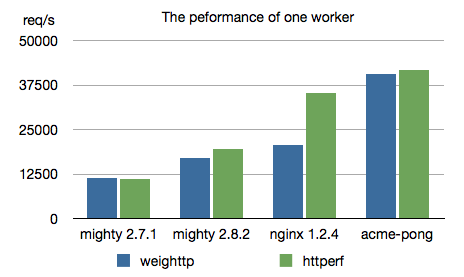
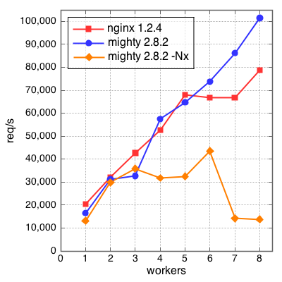

This is sixth article for the series of "Improving the performance of Warp".
Readers are supposed to read the following articles:

1. [Improving the performance of Warp](../9/improving-warp)
2. [Sending header and body at once](../9/header-body)
3. [Caching file descriptors](../9/caching-fd)
4. [Composing HTTP response headers](../9/header-composer)
5. [Avoiding system calls](../9/avoid-syscall)

In this article, I will finally show you the results of "ping-pong" benchmarks.

## Measuring one worker

My benchmark environment is as follows:

- One "12 cores" machine (Intel Xeon E5645, two sockets, 6 cores per 1 CPU, two QPI between two CPUs)
- Linux version 3.2.0 (Ubuntu 12.04 LTS), which is running directly on the machine (i.e. without a hypervisor)

Target web servers are as follows:

- mighty 2.7.1: Mighty without performance improvements described in this series
- mighty 2.8.2: Mighty with performance improvements described in this series
- nginx 1.2.4: the current stable version of `nginx`
- acme-pong: the pong program included in the [acme-http](http://www.haskell.org/pipermail/web-devel/2012/002408.html) package

Mighty 2.8.1 includes all improvements which I descried so far except the http-types hack. "acme-pong" is not a practical web server. It is a reference implementation to determine the upper-bound on Haskell web-server performance.

I tested several benchmark tools in the past and my favorite one is `httperf`. I used `httperf` for the benchmark in this article:

    httperf --hog --num-conns 1000 --num-calls 100 --rate 100000 --server 127.0.0.1 --port 8000 --uri /

This means that 1,000 HTTP connections are established and each connection sends 100 requests. To my experience, we can think that "rate 100,000" is the maximum request rate. 

For all requests, the same `index.html` file is returned. I used `nginx`'s `index.html` whose size is 151 bytes. As "127.0.0.1" suggests, I measured web servers locally. I should have measured from a remote machine but I don't have suitable environment at this moment.

`httperf` is a single process program using the `select()` system calls. So, if target web servers can utilize multi cores, it reaches its performance boundary. Andreas suggested me `weighttp` as alternative. It is based on the `epoll` system call families and can use multiple native threads. I used `weighttp` as follows:

    weighttp -n 100000 -c 1000 -t 3 -k http://127.0.0.1:8000/

Like `httperf`'s case, 1,000 HTTP connections are established and each connection sends 100 requests. Additionally, 3 native threads are spawn.

Since Linux has many control parameters, we need to configure the parameters carefully. You can find a good introduction about Linux parameter tuning in [ApacheBench & HTTPerf](http://gwan.com/en_apachebench_httperf.html).

I carefully configured both Mighty and `nginx` as follows:

- using file descriptor cache
- no logging
- no rate limitation

Here is the result of benchmarks for *one* worker:

Y-axis means throughput whose unit is requests per second. Of course, the larger, the better. What I can see from this results are:

- Mighty 2.8.2 is better than Mighty 2.7.1
- `nginx` has better throughput than Mighty 2.8.2. The result of `weighttp` and that of `httperf` are very different. I don't know why.
- acme-pong suggests there would be more room that we can improve the performance of Mighty/Warp.

## Measuring multiple workers

Since multi-cores is getting more popular, benchmarks for multiple workers would be interesting. Due to the performance limitation, we cannot use `httperf` for this purpose. Since my machine has 12 cores and `weighttp` uses three native threads, I measured web servers from one worker to eight workers(to my experience, three native thread is enough to measure 8 workers). Here is the result:

X-axis is the number of workers and y-axis means throughput whose unit is requests per second. "mighty 2.8.2" (blue) increases workers using the prefork technique while "mighty 2.8.2 -Nx" (orange) increases capabilities with the "-RTS -Nx" option. My observations are:

- `nginx` does not scale if the number of workers is larger than 5.
- Mighty 2.8.2 with the prefork technique does scale at least for 8 workers
- Increasing capabilities of GHC's threaded RTS cannot utilize multi cores if the number of capabilities is larger than 3.

Also, Andreas and I measured Mighty 2.8.2 with Andreas's parallel IO manager. We had very good results but I don't think it is not proper time to show the results now. I hope we can open our results in the future.
